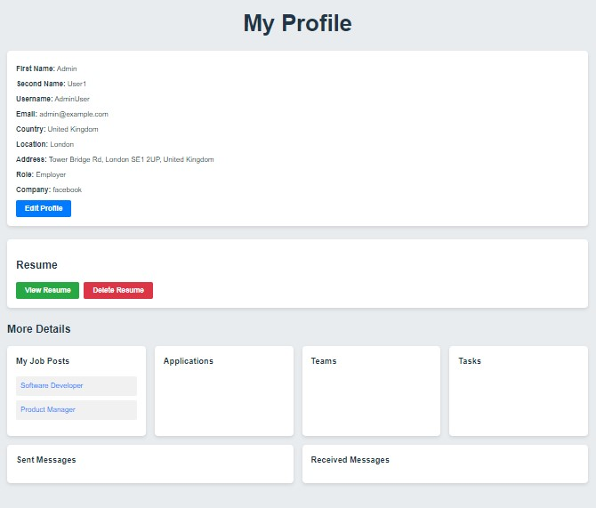

# Remote Work Management
Welcome to the Remote Work Management platform, a comprehensive solution for efficient remote team management and collaboration.

## Current Features

- **Role-Based Access and Profiles**:
  
- **User Authentication**: Secure login and registration with JWT.
- **Dashboard**: Manage all remote work needs from a centralized dashboard.
- **Job Posting**: View, search, and filter available job posts.
- **Profile Management**: Manage user profiles and roles (employer/job seeker).
- **Job Management**: Post, edit, and delete job listings.

- Employers can manage teams, job listings, and project progress.
  - Job seekers can create profiles, search for remote job opportunities, and apply through the platform.


- **Skill Matching and Recommendations**:
  - Utilizes Elasticsearch for job matching based on skills and preferences.
  - Offers upskilling recommendations tailored to user preferences.

- **Remote Work Productivity Analytics**:
  - Tracks productivity metrics like task completion rates and team performance.
  - Generates reports to identify trends and areas for improvement.

## Technologies Used

### Backend Development
- **Server**: Node.js with Express.js
- **Authentication**: JWT (JSON Web Tokens)
- **Database**: MySQL
- **APIs**: Integration with Zoom, Google Docs, and Trello APIs

### Frontend Development
- **Framework**: React.js
- **UI Development**: Responsive interfaces for profiles, job listings, and analytics dashboards
- **Styling**: CSS
- **HTTP Client**: Axios
- **Routing**: React Router
- **State Management**: Context API
- **Notifications**: Toastify
- **Icons**: FontAwesome


## Getting Started

1. Clone the repository:
   ```bash
   git clone https://github.com/Isaacmwangi/remote-work-management.git

2. Navigate to the project directory: `cd remote-work-management`
3. Install dependencies: `npm install`
4. Set up environment variables: Create a `.env` file based on `.env` and configure it accordingly.
5. Start the server: `npm start`
6. Start the frontend: Navigate to the `remote-work-management-frontend` directory and run `npm start`

# This is what I have been able to do currently


### Home Page
When you first open the application, you'll be greeted with the Home Page.


### Register or Login
If you're new to the platform, click on the "Get Started" button to register.


If you're already a user, click on the "Login" link to access your account.


### Dashboard
Upon successful login, you'll be redirected to your dashboard where you can manage all your remote work needs.


### Available
From the dashboard, you can view available job listings. You can filter and search for jobs to find opportunities that match your interests. This show only the top 6 jobs. Below the available Jobs there is a button to view all jobs which will direct you to another page with all jobs.


### Posting a Job
If you're an employer, you can add new job listings to attract potential candidates.


### Job Listing Details
Click on a job listing to view its details. You can see the full description, requirements, and location.


### Edit Job Listing
If you are the employer of a job listing, you can edit or delete the job posting you posted.


### Profile Management
Manage your user profile by updating your personal information and preferences.




## Contributors

- [Isaac Njuguna](https://github.com/Isaacmwangi)
- [Alamin Juma](https://github.com/alamin-juma)

