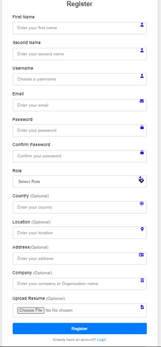
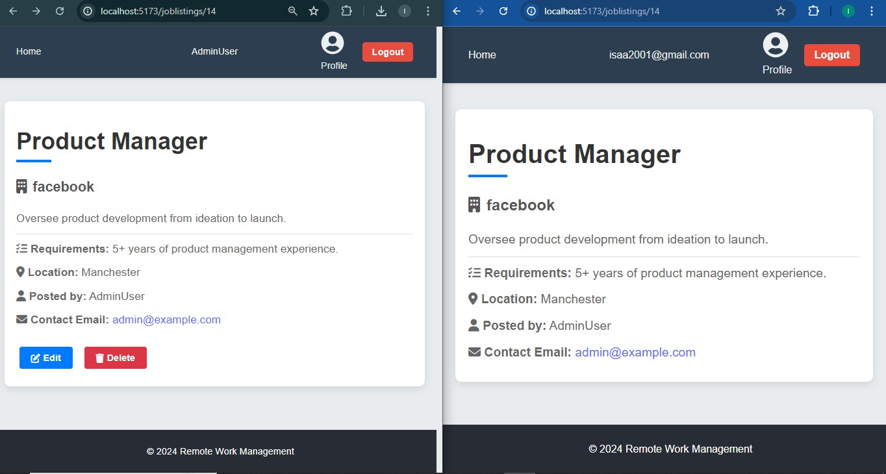

# Remote Work Management Application

This project is a comprehensive platform for managing remote work, featuring user authentication, job management, and profile management.

## Features

- **User Authentication**: Secure login and registration with JWT.
- **Dashboard**: Manage all remote work needs from a centralized dashboard.
- **Job Posting**: View, search, and filter available job posts.
- **Profile Management**: Manage user profiles and roles (employer/job seeker).
- **Job Management**: Post, edit, and delete job listings.

## Technologies Used

- **Framework**: React.js
- **UI Development**: Responsive interfaces for profiles, job listings, and analytics dashboards
- **Styling**: CSS
- **HTTP Client**: Axios
- **Routing**: React Router
- **State Management**: Context API
- **Notifications**: Toastify
- **Icons**: FontAwesome

## Getting Started

### Home Page
When you first open the application, you'll be greeted with the Home Page.

### Register or Login
If you're new to the platform, click on the "Get Started" button to register.

This will direct you to Register page were you will be required to fill all the form given to register

If you're already a user, click on the "Login" link to access your account.

### Dashboard
Upon successful login, you'll be redirected to your dashboard where you can manage all your remote work needs.

### Available Jobs
From the dashboard, you can view available job listings. You can filter and search for jobs to find opportunities that match your interests. If you are an employer you will see a button to Post a job just next to the search

### Post a Job 
If you're an employer, you can add new job listings to attract potential candidates.

### Posted Job Details
Click on a job you need to view its details. You can see the full description, requirements, location and a contact email.

### Editing your Job
If you are the owner of the posted job, you can edit or delete the job posting you posted.

### Profile Management
Manage your user profile by updating your personal information and preferences.

## Contributors

- [Isaac Mwangi](https://github.com/Isaacmwangi)
- [Alamin Juma](https://github.com/alamin-juma)
