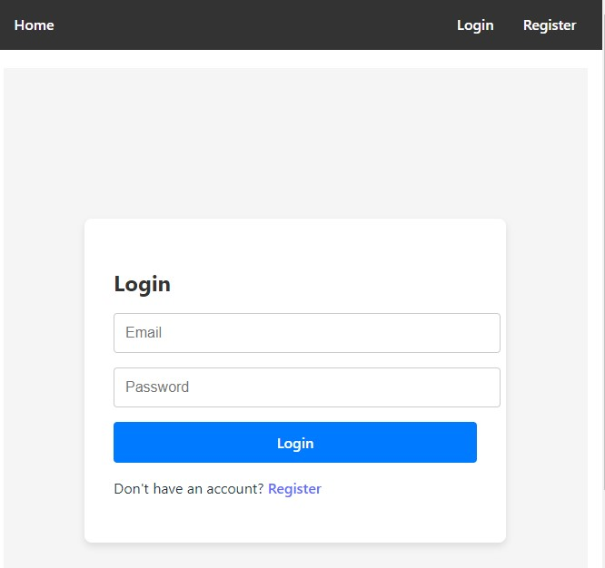

# Remote Work Management - Frontend

Welcome to the frontend repository for Remote Work Management! This project aims to streamline remote team management through intuitive user interfaces and seamless integration with backend services.

## Screenshots

### Home Page

### Registration Page
If you are a new user, click on "Get Started" or "Register" to create an account.

### Login Page
After registration, proceed to the login page to access your account.

### Dashboard
Upon successful login, you will be directed to the dashboard where you can manage your profile, view job listings, and more.

