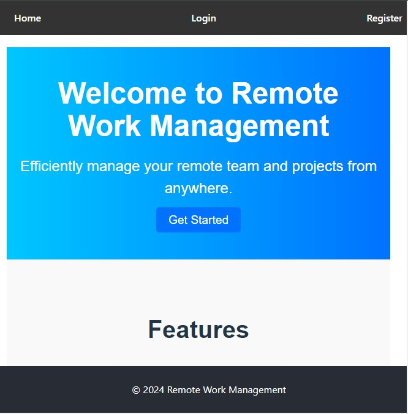

# Remote Work Management Application

This is a comprehensive platform for managing remote work, featuring user authentication and CRUD operations for managing job listings and user profiles.

## Current Features

- **User Authentication**: Secure login and registration with JWT.
- **Dashboard**: Manage all remote work needs from a centralized dashboard.
- **Job Posting**: View, search, and filter available job posts.
- **Profile Management**: Manage user profiles and roles (employer/job seeker).
- **Job Management**: Post, edit, and delete job listings.

## Technologies Used

- React
- JavaScript (ES6+)
- CSS
- Axios
- React Router
- Context API
- Toastify

## Getting Started

Follow these steps to navigate through the application:

### 1. Home Page

When you first open the application, you'll be greeted with the Home Page.

### 2. Register or Login

If you're new to the platform, click on the "Get Started" button to register.

If you're already a user, click on the "Login" link to access your account.

### 3. Dashboard

Upon successful login, you'll be redirected to your dashboard where you can manage all your remote work needs.

### 4. Job Listings

From the dashboard, you can view available job listings. You can filter and search for jobs to find opportunities that match your interests.

### 5. Add Job Listing

If you're an employer, you can add new job listings to attract potential candidates.

### 6. Job Listing Details

Click on a job listing to view its details. You can see the full description, requirements, and location.

### 7. Edit Job Listing

If you are the employer of a job listing, you can edit or delete the job posting you posted.

### 8. Profile Management

Manage your profile by updating your personal information and preferences.

